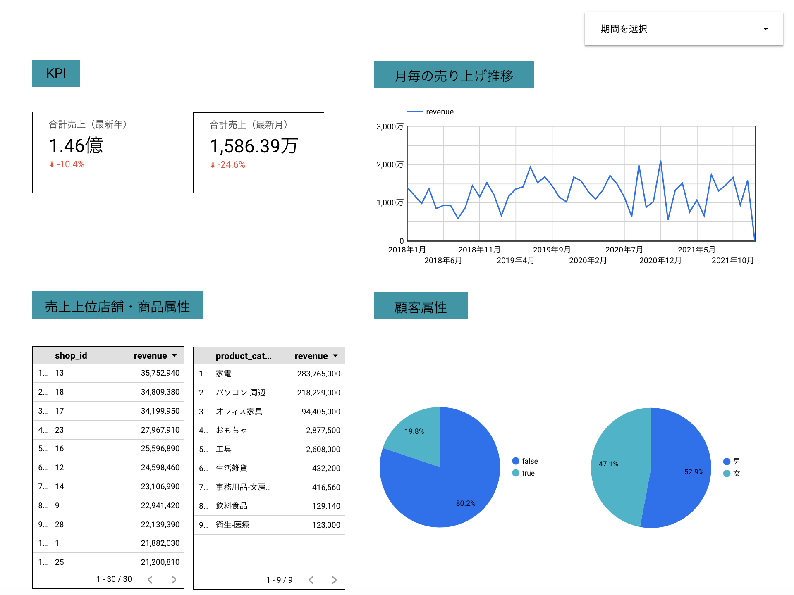

# Google BigQueryとGoogle Data Portal【旧Data Studio】から始めるデータ活用入門

## セクション1: 紹介
## ゴール
1. BigQuery上での基本的なデータ抽出・分析の取得
2. BigQueryとData Portalを連携し、データマートの設計とダッシュボードの作成。

## セクション2: はじめに
* データ活用に必要なシステム全体像

## セクション3: データ基盤の基礎
* 各システム
    * データソース
    * ETL（ELT）
        * Talend
        * IBM InfoSophere
        * DataStage
        * RapidMiner
        * DataSpider Cloud
    * DWH
        * BigQuery
        * Redshift
        * Snowflake
    * DM
        * 一般的にはDWHで採用されているシステムの上に構築されるケースが多い
    * BIツール
        * Data Portal
        * Power BI
        * Tableau
* 最近のトレンド
    * ETLからELT
        * DWHの前にDataLakeを置く
    * 上記のシステムの垣根が曖昧になってきている

## セクション4: BigQueryとSQLの基礎（基本概念~環境構築まで）
* BigQueryについて
    * コンソールにアクセス
    * サンプルCSVからテーブルを作成
    * SQLの実行と保存

## セクション5: BigQueryとSQLの基礎（SQLの基本構文）
* SQLの基礎
* 横持ち、縦持ちフォーマット
    * 縦持ちフォーマット
        * 1列=1変数
        * 1行=1観測
    * 横持ちと縦持ちの変換
        * PIVOT
        * UNPIVOT

## セクション6: Data Portalとデータ可視化の基礎（基本概念~環境構築まで）
* Looker Studioについて

## セクション7: Data Portalとデータ可視化の基礎（Data Portalの基本操作）
* Looker Studioの基本操作
* 演習
    * DMの作成
    * ダッシュボードの作成
        * 

## セクション8: 【チャレンジ】国勢調査（労働力調査）データを使ったダッシュボード作成
* 
