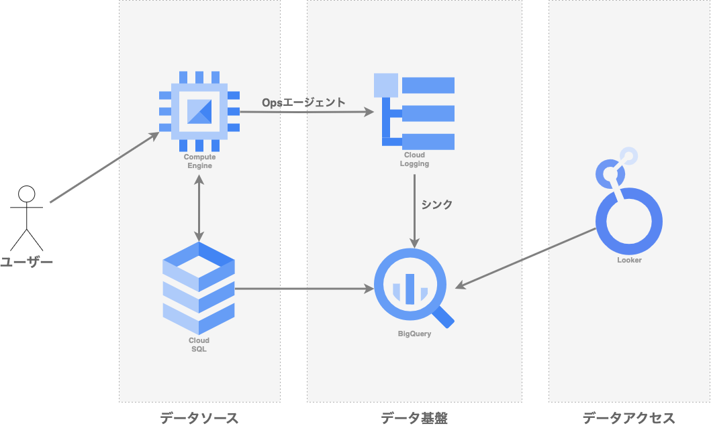

# GCPデータ分析基盤

## 参考記事
* [GCPのデータ処理・ETL系サービスの使い分け](https://qiita.com/tomoyanamekawa/items/e45317bada702159add0)
* [Cloud Monitoring と Cloud Loggingについて](https://konan0802-cautious-space-robot-5xxr7grqg64f7x5r.github.dev/?autoStart=false)
* [Loggingエージェントを捨ててOpsエージェントに乗り換える](https://cloud-ace.jp/column/detail284/)

